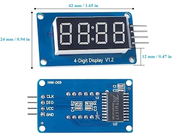

# A Segmented LED Display for SenseESP and SignalK
This demonstrates how to use an inexpensive segmented LED display such as the one below to display data from SignalK.  For example:
* engine hours
* counter for bilge pump cycles
* alternator voltage
* relative humidity
* temperature
* time (or anything represented by a digital 'clock')

The examples from my initial prototyping show how outside temperature (in either degrees C or F), an integer value, and 24h time might look on a small 4 digit display.  Note that the red LEDs appear washed out in all my pictures, but in person they much crisper and brighter than these pics (even at brighness level '2').

## Hardware
My testing has been with an ESP32 dev board, and 4 digit version of the TM1637.  I purchased five of these displays for about $8 US:

I simply made 4 connections for ground, 3V, and GPIO with Clock & Data. No additional resistors or capacitors were neccessary to make it work.

## Signal K configuration
Initially I used the value from `environment.outside.relativeHumidity` for development, because my signal K instance was already configured to get NOAA weather data using a fixed position.  See [signalk-noaa-weather](https://github.com/sbender9/signalk-noaa-weather) and [signalk-fixed-position](https://github.com/saillogger/signalk-fixed-position)) for info on these two plugins.  This configuration should work with a dev-only instance of signal K, using no other sensors or input besides an internet connection.  An alternative to `signalk-fixed-position` is [signalk-fixedstation](https://github.com/inspired-technologies/signalk-fixedstation-plugin).  Later I also used `environment.time` from [environment.time](https://github.com/tmcolby/signalk-datetime) because I could easily verify that this was updating on the minute in sync with the linux system time.

In all cases, you first need to get the data that you want to display *in* to Signal K, in order to then read it with an [SKValueListener\<T\>](https://signalk.org/SensESP/generated/docs/classsensesp_1_1_s_k_value_listener.html).  For example, if you want to display engine hours, you would need to first have something like an N2K interface reading it from your engine's wiring harness, or perhaps another SensESP device that detects when the engine is running and accumulates time in SignalK or Node Red.

Here are some example paths that could be consumed from:
* Engine hours: `propulsion.0.runTime` (from [/vessels/\<RegExp\>/propulsion/\<RegExp\>/runTime](https://signalk.org/specification/1.5.0/doc/vesselsBranch.html#vesselsregexppropulsionregexpruntime))
* bilge pump cycles: `electrical.pumps.primaryBilge.log` (from [/vessels/\<RegExp\>/electrical](https://signalk.org/specification/1.5.0/doc/vesselsBranch.html#vesselsregexpelectrical))
* bilge water level: `environment.inside.bilge.currentLevel` (from [/vessels/\<RegExp\>/environment/inside/[A-Za-z0-9]+](https://signalk.org/specification/1.5.0/doc/vesselsBranch.html#vesselsregexpenvironmentinsidea-za-z0-9))
electrical.pumps.bilge.0.log
* Alternator volts: `electrical.alternators.0.voltage` ([/vessels/\<RegExp\>/electrical/alternators/\<RegExp\>/voltage](https://signalk.org/specification/1.5.0/doc/vesselsBranch.html#vesselsregexpelectricalalternatorsregexpvoltage))

## SensESP Project Template

This project was forked from the template for [SensESP](https://github.com/SignalK/SensESP/) projects.

Comprehensive documentation for SensESP, including how to get started with your own project, is available at the [SensESP documentation site](https://signalk.org/SensESP/).

## AceSegment
This also leverages the high level classes provided by [AceSegment](https://github.com/bxparks/AceSegment) and [AceSegmentWriter](https://github.com/bxparks/AceSegmentWriter)